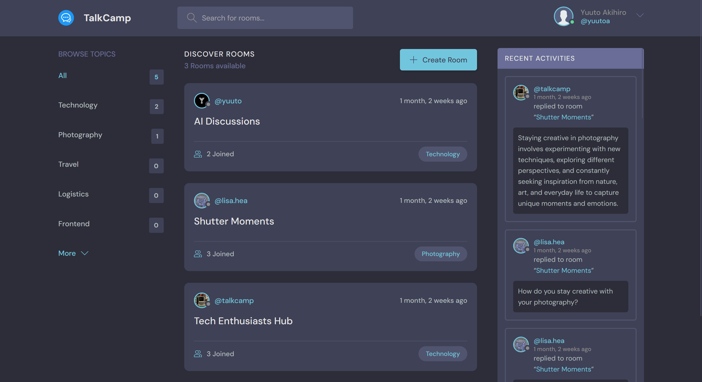
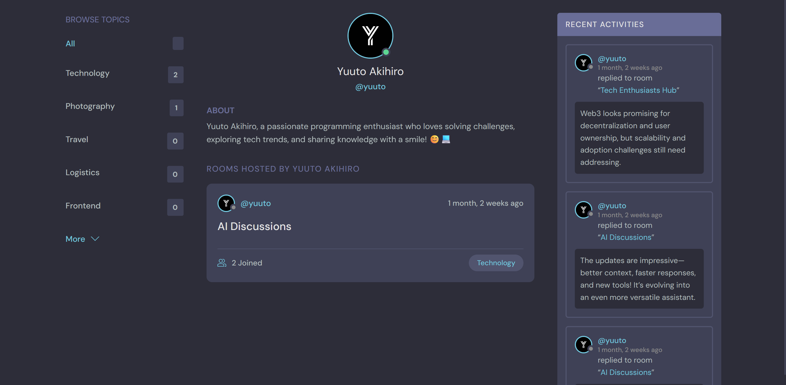
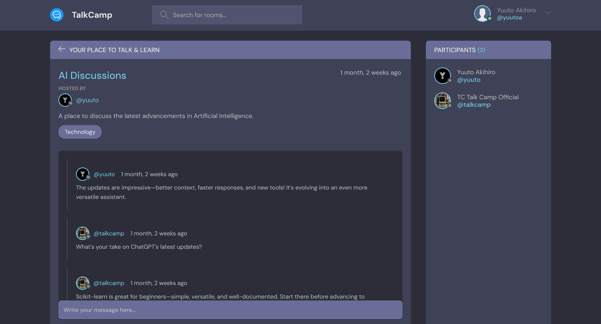
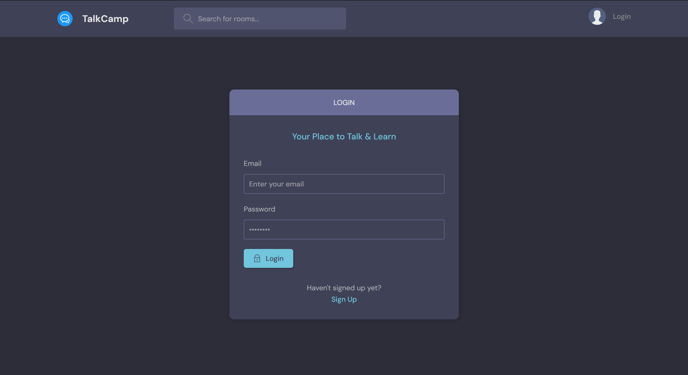

# TalkCamp Web App

- [Overview](#overview)
- [Project Preview](#project-preview)
- [Installation and Usage](#installation-and-usage)
- [Usage Instructions](#usage-instructions)

---

## Overview
TalkCamp is a Django-based web application designed for interactive discussions and learning. The application allows users to create custom Rooms and assign them topics, which act as categories. Users can join rooms, start messaging, track participant activities, browse topics, and search for interesting content through a search bar in the navigation. The app also includes user authentication with registration and login, offering security features to protect user data.

---

## Project Preview
Below are some preview images showcasing the TalkCamp Web App:






---

## Installation and Usage

1. **Clone the Repository:**  
```bash
 git clone https://github.com/yuutoa/talk-camp-webapp.git
 cd talk-camp-webapp
```

2. **Create and Activate Virtual Environment:**  
```bash
python -m venv venv
venv\Scripts\activate  # On MacOS or Linux use: source venv/bin/activate
```

3. **Install Dependencies:**  
```bash
pip install -r requirements.txt
```

4. **Apply Migrations:**  
```bash
python manage.py migrate
```

5. **Run the Application:**  
```bash
python manage.py runserver
```

6. **Access the Application:**  
Open your browser and go to: [http://127.0.0.1:8000](http://127.0.0.1:8000)

---

## Usage Instructions
- Register a new account or log in if you already have one.
- Create, view, update, or delete Rooms as needed.
- Browse Topics and search for content using the search bar.
- View and join rooms, interact with other participants through messaging.
- Create or update your profile by uploading a picture and writing a description.
- Track your activity and view others' activity from their profiles.

---

[Yuuto Akihiro](https://github.com/yuutoa)
